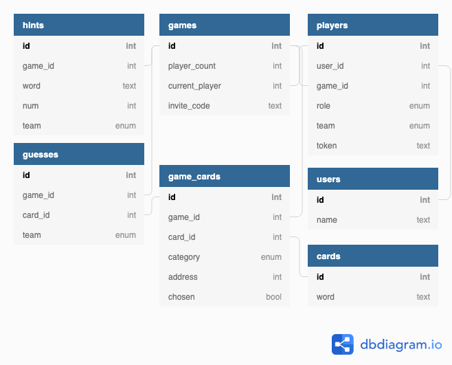

# Codewords Server [](https://travis-ci.com/code-words/codewords-server)

This is the server side of the Codewords game. It manages game state and handles turn logic, however it does not have a built-in front-end. You will also need the Codewords UI available within this organization.

### Requirements

- Ruby 2.6.3
- Rails 5.2.3
- This server

### Setup

<details><summary>Need to set up a Ruby environment? MacOS instructions within.</summary>

_Note: Depending on your existing setup, you may be able to skip one or more of the steps below. If you're not sure whether you have something installed or not, go ahead and run the respective command, and the command-line tools we're using will let you know that you're good to go._
First, we'll install a Ruby environment manager. [rbenv](https://github.com/rbenv/rbenv) gives you very straightforward tools to manage which version of Ruby you use for a particular project.
- `brew install rbenv`
- `rbenv init`
  - This will instruct you to add content to your `~/.bash_profile`. Do so.
- `source ~/.bash_profile`
- `curl -fsSL https://github.com/rbenv/rbenv-installer/raw/master/bin/rbenv-doctor | bash`
  - The above command should report green across the board. If you get anything else, you'll need to search for assistance on the internet.

Now that rbenv is installed, we need to install Ruby. This project uses Ruby 2.6.3, so we'll start there.
- `rbenv install 2.6.3`
  - If you have used `rbenv` to install Ruby before, you will need to set the correct Ruby version for this project.
  - Once you have cloned down this repository, `cd` into the project root.
  - Run `rbenv local 2.6.3`. (This step can be skipped if `rbenv global` reports you're already using `2.6.3`)
  - With Ruby, the package manager we use is called [Bundler](https://github.com/bundler/bundler). Let's be certain you have the right version.
  - Run `gem install bundler -v 2.0.2`

Next, we'll install the [PostgreSQL](https://formulae.brew.sh/formula/postgresql) database.
- `brew install postgresql`

Finally, we'll install [Redis](https://formulae.brew.sh/formula/redis), which is used to manage our Websockets broadcasts
- `brew install redis`
- redis runs as a service in the background. It uses very little resources, so we'll go ahead and start it now.
- `brew services start redis`
- It will need to be active anytime we're running the server, however you can stop it whenever you don't need it with `brew services stop redis`

At this point, we have everything we need for our Rails environment. If you wish, you can also globally install Rails with `gem install rails -v 5.2.3` however Bundler will ensure you have what you need for this project.

</details>

01. Clone this repository and run `bundle install`.
02. Prepare database with `rails db:create`
03. Migrate with `rails db:migrate`
04. Start the server with `rails s`


### Schema

[](https://dbdiagram.io/d/5d28ffa3ced98361d6dc9ccb)

## API Endpoints

- [Create/Initiate Game](#create-game)
- [Join Existing Game](#join-game)
- [Get Intel Data](#get-intel)

---

### Create Game

Request that the server create a new Game instance and attach the requesting user as a Player. Because we are not managing persistent users at this time, this endpoint also creates a User record for the requesting user.

##### Request
```http
POST /api/v1/games
```
```js
{
  "name": "Archer"
}
```
|key|description|
|:---:|:--- |
|`name`|The username that the requesting user would like to use during the game|

##### Successful Response
```http
HTTP/1.1 201 Created
```
```js
{
  "game_channel": "game_9aZReVkGAotVahGLS88vEnYw",
  "invite_code": "L6J5suAqTsKUAjEXm5swoEUN",
  "name": "Archer",
  "token": "uuxHQc7djqQuzWgJxAp5r1vy"
}
```
|key|description|
|:---:|:--- |
|`game_channel`|The Websockets channel that players will connect to for game-wide data updates.|
|`invite_code`|A code which can be shared with other players. They will use this code to join the game.|
|`name`|A confirmation that the requested name was indeed assigned to the player.|
|`token`|A token unique to the current player, which can be used to identify them in future requests to the server.|

<details><summary>Failed Responses</summary>

##### Name Omitted
This error occurs if the body of the request does not contain a `name`, or if the `name` is empty.
```http
HTTP/1.1 401 Unauthorized
```
```js
{
  "error": "You must provide a username"
}
```

</details>

---

### Join Game

Request that the server create a new Player instance for the requesting user and attach it to the Game denoted by the invite code.

##### Request
```http
POST /api/v1/games/:invite_code/players
```
```js
{
  "name": "Lana"
}
```
|key|description|
|:---:|:--- |
|`:invite_code`| (Within URI) The invite code provided by the person inviting the requesting user to their existing game.|
|`name`|The username that the requesting user would like to use during the game|

##### Successful Response
```http
HTTP/1.1 200 OK
```
```js
{
  "game_channel": "game_9aZReVkGAotVahGLS88vEnYw",
  "name": "Lana",
  "token": "uuxHQc7djqQuzWgJxAp5r1vy"
}
```
|key|description|
|:---:|:--- |
|`game_channel`|The Websockets channel that players will connect to for game-wide data updates.|
|`name`|A confirmation that the requested name was indeed assigned to the player.|
|`token`|A token unique to the current player, which can be used to identify them in future requests to the server.|

<details><summary>Failed Responses</summary>

##### Name Omitted
This error occurs if the body of the request does not contain a `name`, or if the `name` is empty.
```http
HTTP/1.1 401 Unauthorized
```
```js
{
  "error": "You must provide a username"
}
```

##### Name Already In Use
This error occurs if the `name` requested by the user is already in use by another Player in this game.
```http
HTTP/1.1 401 Unauthorized
```
```js
{
  "error": "That username is already taken"
}
```

##### Invalid Invite Code
This error occurs if the invite code provided by the user does not match a current game.
```http
HTTP/1.1 401 Unauthorized
```
```js
{
  "error": "That invite code is invalid"
}
```

##### Game Is Full
This error occurs if the invite code provided for the user matches a game that does not have room for additional players.
```http
HTTP/1.1 401 Unauthorized
```
```js
{
  "error": "That game is already full"
}
```

</details>

---

### Get Intel

Request the Intel data for a game, allowing the player to see which cards belong to which team, which are bystanders, and which is the assassin. This endpoint requires a valid token belonging to a player with the intel role.

##### Request
```http
GET /api/v1/intel
```
```js
{
  "token": "uuxHQc7djqQuzWgJxAp5r1vy"
}
```
|key|description|
|:---:|:--- |
|`token`| A valid token belonging to a Player with the Intel role.|

##### Successful Response
```http
HTTP/1.1 200 OK
```
```js
{
  "cards": [
    {
      "id": 0, // int card id
      "type": "red" // red, blue, bystander, or assassin
    }, // ... one for each card
  ]
}
```
|key|description|
|:---:|:--- |
|`cards`|A collection of cards which are part of the game.|
|`id`|The unique identifier for the card.|
|`type`|The type of card to render in the UI: "red", "blue", "bystander", or "assassin".|

<details><summary>Failed Responses</summary>

##### Token Omitted
This error occurs if the body of the request does not contain a `token`, or if the `token` is empty.
```http
HTTP/1.1 401 Unauthorized
```
```js
{
  "error": "You must provide your access token"
}
```

##### Invalid Token Code
This error occurs if the provided token does not match a player.
```http
HTTP/1.1 401 Unauthorized
```
```js
{
  "error": "Unable to find a user with that token"
}
```

##### Player Does Not Have Intel Role
This error occurs if the token matches a player who does not have the Intel role for the game.
```http
HTTP/1.1 401 Unauthorized
```
```js
{
  "error": "You are not authorized for this game's secret intel"
}
```

</details>
